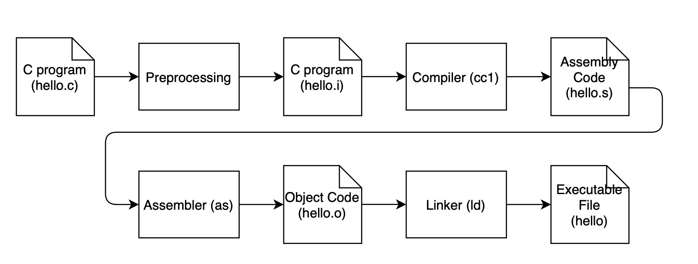

# From Source to Binary 讀後心得

讀了一下 Jserv 大大的 slide 們頗有啟發
就決定筆記一下裡面的重點並且查了點資料補足自己不知道的地方

整理得有點亂七八糟就敬請見諒了 QQ (有空再慢慢補充修正)

## 1. GCC 幫我們做了哪些事情

```C
#include <stdio.h>
int main(void){
    printf("Hello World!\n");
    return 0;
}
```

上面是你我都熟知的 hello world 程式，我們想知道 `gcc hello.c -o hello` 背後發生了什麼事情。



- Preprocessing : 展開 macro, include (`.c` -> `.i`)
- Compilation : C Code -> Assembly  (`.i` -> `.s`)
- Asselbler : Assembly code -> Object Code   (`.s` -> relocatable obj file `.o`)
- Linker : Object Code -> Machine Language (Create Executable object file)

## 2. Preprocessing

`gcc -E hello.c -o hello.i`

- macro 展開
- 參照標頭檔的內容展開

### include search path 在哪？

`cpp -v /dev/null -o /dev/null` 可以看到

`man cpp` 可以發現他就是 C preprocessor (C++也用這個)

## 3. Compilation

- C code -> IR -> Target Code (Assembly)
- 裡面有很多細節，但大致上還是 Frontend, IR, Backend 的結構，有興趣的可以看 jserv 大大的 slide

`gcc -S hello.c`

### The phases of a compiler (複習恐龍書)

1. Lexical
    - scanner (lexical analyzer)，一個一個 character 去讀，然後幫忙 tokenize
    - 用 regular expression (DFA) 檢查 tokens 是否符合規定
    - 使用 Lex/Flex
2. Syntax
    - parser 去檢查 token 們有沒有符合文法
    - 用 CFG 檢查句子是否符合 grammar，最終產生 AST
    - 使用 YACC/Bison
3. Semantic
    - Symbol table
        - 在 symbol definition 的時候插入到 symbol table 內
        - 在 local symbol reference 的時候檢查是否存在於 symbol table 中 (external symbol reference 要等到 linker 才會檢查)
    - Type checking
    - semantic analysis for control structures
4. IR Code generation
5. Optimizer
6. Target Code Generation
    - storage allocation

## 4. Assembler

### Object Files

Assembler 會將 Assembly code 組譯成 Object Code Files，因此我們要來先了解什麼是 object file。object file 會由 assembler 或 linker 產生，一般來說可以分成三類：
- Relocatable obj file (`*.o`)
    - holds code and data suitable for linking with other object files to create an executable or a
shared object file.
    - 不能直接執行，因為他很多 address 都沒有填上
- Executable obj file (default `a.out`)
    - holds code and data that can be copied directly into memory then executed
- Shared obj file (`*.so`)
    - a special type of relocatable object file that can be loaded into memory and linked dynamically, at either load time or run time.

- Object File Formats
    - 為了 portable 所以規範 object file 的格式
    - UNIX 系統用的標準格式是 ELF (Executable and Linkable Format)

### ELF Format
- 可以簡單分為 File Header, Program Header、Sections 以及 Section Table 四個部分
- Headers (自行查表)
- Sections : `.text` (code), `.data` (initialized static data), `.bss` (uninitialized static data)
- Section Table : `.symtab` (symbol table)、`.rel.txt, .rel.data` (relocation information)，這些都是 linker 日後連結時需要用的資訊。像是需要把多個 obj file 的 `.text` section 合併、Function Definition 跟 Reference 要對上(靠Symbol Table)、Static data 統一放到 `.data` or `.bss` section，並且填上位置。
- 更詳細的可以參考
    - [wikipedia](https://en.wikipedia.org/wiki/Executable_and_Linkable_Format#File_header)
    - [某課程的 slide](http://web.cse.ohio-state.edu/~reeves.92/CSE2421au12/SlidesDay51.pdf)

### 回到 as

- as 的任務不外乎就是產生 relocated obj file
- 就只是把 assembly code 轉成 object code 格式，不知道的就填 0，然後產生一個 table 給 linker 用
- 另外他的 output 檔得讓 linker 知道 `printf()` 在哪
    - 因此需要有 symbol table 以及 relocation table

`gcc -c hello.c`

## 5. Linker

### Static Library

- 一堆 object file 合在一起，就可以產生 static library (`.a`)
- 可以用 `ar` command 去建立、刪除、觀察 static library

### 回到 Linker

- 將多個 object file & library file (`.a`) merge 成 executable object file
- 以前人們寫程式只能把 program 寫在一個檔案中，現在可以分開產生 object file 最後再透過 linker 整合成一個執行檔
- Linker 做的事情就是 -- 靜態連結程式碼

> ps 很喜歡 jserv 大大投影片的比喻
> 「上窮碧落下黃泉」-> Symbol Resolve
> 「一切依法處理」  -> Relocation Type

`gcc hello.c`

## 6. Loader

- Runtime 的時候把動態 library (`.so`) 連結 dynamic link 上來

## 其他補充

### 一些 gcc 常用參數

```
# Debug Usage
-E  # only preprocessing
-S  # only assembly
-c  # no linking
-g  # debug

-I  # 增加 include file 搜尋資料夾
-L  # 增加 library file 搜尋資料夾
-l  # 指定 link 的函式庫
```

- 一些不錯的學習資源
    - [undefined symbol, reference 解決 SOP](https://medium.com/fcamels-notes/解決-linux-上-c-c-的-undefined-symbol-或-undefined-reference-a80ee8f85425)
    - [常用 UNIX Environment](https://stackoverflow.com/questions/16044020/gcc-and-linking-environment-variables-and-flags)
    - ps. 莫忘 `LD_PRELOAD`

## Reference

- Jserv 大大的 slide 們
    - [How A Compiler Works: GNU Toolchain](https://www.slideshare.net/jserv/how-a-compiler-works-gnu-toolchain)
    - [from Source to Binary: How GNU Toolchain Works](https://www.slideshare.net/jserv/from-source-to-binary-how-gnu-toolchain-works/46)
- http://web.cse.ohio-state.edu/~reeves.92/CSE2421au12/SlidesDay51.pdf

### License

<a rel="license" href="http://creativecommons.org/licenses/by-sa/4.0/"></a><br />This work is licensed under a <a rel="license" href="http://creativecommons.org/licenses/by-sa/4.0/">Creative Commons Attribution-ShareAlike 4.0 International License</a>.
