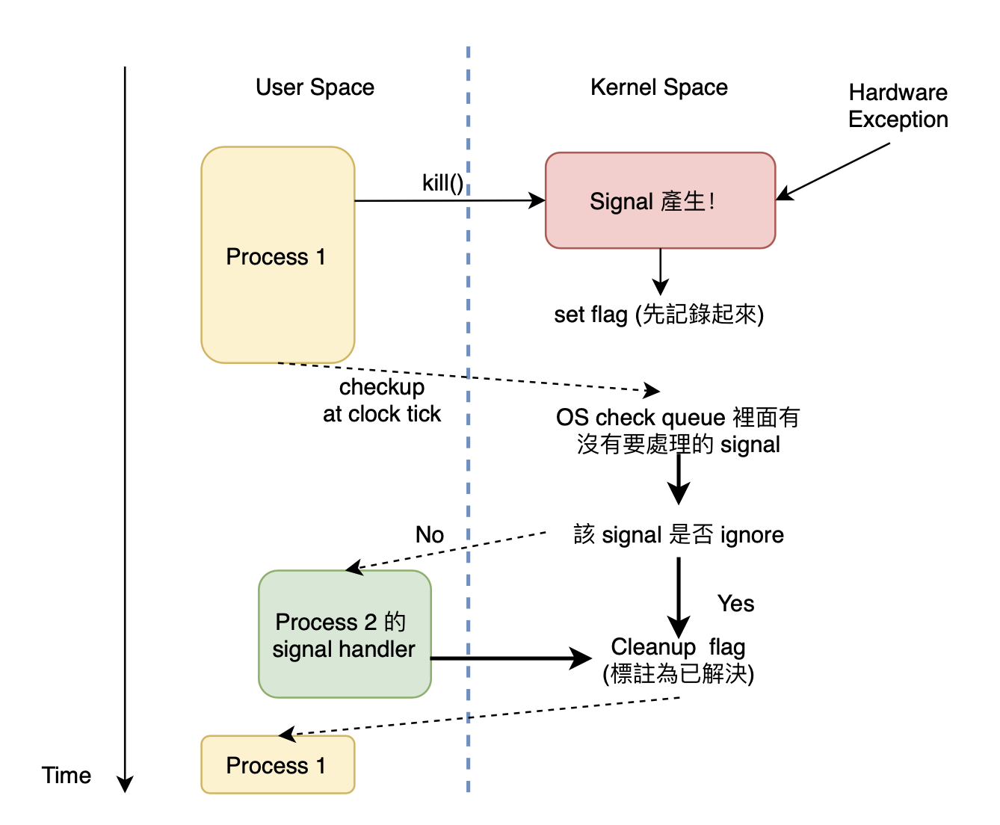

# Ch10 Signal
---

## 10.1 Signal 定義

- Software interrupt (提醒 process 某些重要事件)
- UNIX 系統處理 asynchronous events 的一種規範
- 舉例：在 Terminal 上面 type Ctrl-C 的時候會送一個名為 SIGINT 的 signal 給該 process，該程式收到之後就知道要停止

## 10.2 Signal 基本概念

- Signal 的數量是固定的，可以 `man signal` 去看。大多數 signal 都是作業系統設定好的，user 只能自己定義 SIGUSR1, SIGUSR2。
- 再次重申 Signal 通常用在要通知 process 一個突發事件。因此可以看作是一個 signal to action 的 pair 來學習。 

### A. Overview



本章重點有三：
1. Signal 如何被產生
2. Kernel 收到 signal 到 Signal 被 Deliver 中間發生什麼事情
3. Signal Deliver 的實作與機制

### B. Signal Generation

- Terminal-generated
    - 通常會使程式終止
    - 舉例：SIGINT (Ctrl-C)、SIGQUIT (Ctrl-\)、SIGTSTP (Ctrl-Z)
- Hardware exceptions : 硬體錯誤
    - 硬體首先偵測到問題並通知 kernel，接著 kernel 發送 signal 給 user process 
    - 舉例：divide by 0, invalid memory access, ...
- Software Conditions : 
    - 並不是 hardware 偵測到錯誤
    - 當某些 Software 事件發生時，signal 用於通知該程式
    - 舉例：
        - SIGPIPE : a process writes to a pipe that has no reader)
        - SIGALARM : an alarm clock set by the process expires
- Function kill() : owner 或 superuser 可以發送 (ex:shell command kill)

### C. Signal Delivering

- 我們會稱作 Action / Disposition of a signal
- 前面提到 signal 可以用於處理 "asynchronous events"，因此他會在隨機的時間發生
- 每個 process 可以告訴 kernel 說：當該 signal 發生的時候要怎麼做
- Process 可選的處理動作有三：
    - Ignore
        - 例外：SIGKILL, SIGSTOP 無法被忽略
        - 無視 Hardware Exception 是 undefined behavior
    - Catch
        - 自行定義 function 把該 signal 吃下來
        - 例外：SIGKILL, SIGSTOP 無法被 catch
        - 舉例：
            - 等到收到 SIGCHILD 的時候再 call waidpid 收屍 clild process 就好
            - 把 SIGTERM, SIGINT 接下來，避免使用者簡單的使用終端機就把 process 砍了
    - Default : 詳見 man page，有 Terminate, Ignore 或 Stop 三個可能

Note : 
1. APUE 有詳細的各 signal 介紹，這個可以自己翻 man page 就好
2. 關於 Core Dump 的補充 (待補)


## 10.3 如何處理 Signal

### A. Signal Function

首先要來介紹 UNIX 系統最早處理 signal 的 API -- `signal()` 函式。signal 這個函式用於建立 signal handler。

```C
#include <signal.h>
void (*signal(int signo, void (*func)(int)))(int);
```

- 第一個 argument : signal number
- 第二個 argument : Function pointer，用於告訴系統 signo 發生時要去做什麼事情。
- 三個特殊 Function
    ```C
    #define SIG_ERR  (void (*)())-1
    #define SIG_DFL  (void (*)())0
    #define SIG_IGN  (void (*)())1
    ```
- 不然也可以自己撰寫 signal-catching function，例子如下：
    ```C
    signal(SIGUSR1, my_func);
    void my_func(int signo){
    # ... do something
    }
    ```
- Return : 前一個 signal handler 的位置
    - 補充說明：這裡不太好理解他的意思，因此以上面的例子說明。假如本來 SIGUSR1 的 handler 是 SIG_DFL，在註冊 `signal(SIGUSR1, my_func)` 的時候就會將 SIGDFL 改指到 `my_func()`，並 return SIGDFL 的位置。
- 其他值得注意的事情：
    - 該 process 呼叫 `exec` 的時候，所有的 signal handler 都會被設定回 default。
    - 該 process 呼叫 `fork` 的時候，所有的 signal handler 都會繼承。
    - Terminal 會預設將 background process group 的 interrupt & quit signal 設定成 ignore，避免 Ctrl-C 關掉它

### B. Signal Function 的缺點

> Unreliable Signal -- 也就是說 signal 會掉！

1. 在呼叫 `signal()` function 之前不知道該 process 的 signal deposition 是什麼。
    - **The action for a signal was reset to its default each time the signal occurred**.
    - 因此在舊有的 code 常有這種寫法 (確定現在不再 ignore 的狀況)
    ```C
    int sig_int();
    if (signal(SIGINT, SIG_IGN) != SIG_IGN)
        signal(SIGINT, sig_int);
    ```
    - 另外，因為 signal 被呼叫後會被重設回 default action，因此常常在 signal handler 中重新註冊 signal。如果該 signal 在重新註冊好之前 interrupt 進來就掛了。
2. 該 process 在 busy 的時候只能選擇 ignore signal 或選擇被打斷，無法在 handle signal 忙碌時僅記錄下來等等處理。

Note : 可以參考 apue 的例子。

### C. Interrupted System Call

> Signal 插入的時候，如果系統正在做 System Call 怎麼辦？

Slow System call (non disk I/O) 會被 interrupt，並且送一個 EINTR 的 errno 給該 process。
- 舊的系統常常會自己重寫
```C
again:
    if ((n = read(fd, buf, BUFFSIZE)) < 0) {
        if (errno == EINTR)
            goto again; /* just an interrupted system call */
           /* handle other errors */
    }
```
- 新的系統已經 default 會重新呼叫 system call。

## 10.4 Reentrant Function

- 什麼是 reentrant function
    - Function is called reentrant if it can be interrupted in the middle of its execution and then safely called again ("re-entered") before its previous invocations complete execution
    - 在這裡 reentrant function 只討論被 interrupt 或者被 signal 打斷的狀況，主要在探討 multi-task 的狀況下該 function 是否有問題。
    - 詳細可以參考這篇很棒的[維基百科](https://en.wikipedia.org/wiki/Reentrancy_(computing))

- 怎麼樣的 Function non-reentrant
    - static data structure (static or global variable)
    - malloc, free function
    - 一些 standard I/O library (ex:printf 共用 buffer)
    - Updating of a data structure – longjmp()

- 什麼時候需要用上他
    - 會在 multi-thread function & signal handler 遇上
    - 因此在撰寫這些 function 的時候要注意是否是 reentrant function 以確保程式每次執行的結果都相同。

## 10.5 Reliable Signal

- Quick Review
    - Signal Generation -> Pending -> Signal Deliver (先前說的)
    - signal function 的問題們 (會造成 unreliable signal)
        - 無法 pending 等等收 signal
        - 需要重複註冊 signal
        - 無法知道舊的 signal action
- 改進後 (換 API & 發明的 **signal block** 機制)
    - Signal Generation : 產生 signal 並記錄於 kernel space。 (set flag)
    - Signal Pending : Signal 產生到 Deliver 中間的時間差
    - Signal Deliver : Kernel 發送給特定 process signal，採取 action
        - Process 可以設定 block 特定 signal，直到他 unblock 或者設定成 ignore。
        - 可以透過 `sigpending()` 這個 function 判斷哪些 signal 在 pending, block
        - POSIX 沒有規定 signal 執行的順序，不過通常都是越重要的越先執行
    - Signal Queue
        - 因為有 block 的設計，所以就會需要 queue 去存放對一個 process 重複送同個 signal
        - 作業系統可能會發送給 process 一次 or 多次 signal (POSIX 沒有定義)

## 10.6 Signal 相關 API

### A. Signal Generation

```C
#include <signal.h>
int kill(pid_t pid, int signo); // 送 signal 給特定 給特定 process 或 process group
int raise(int signo);           // 送 signal 給自幾
```

- Superuser 或 uid or euid 相同才可以送 signal
- `kill(0)` 可以送一個無害的 signal
- 用法自己去 man (記得要 `man 2 kill` 才會看到 C 的 API)

### B. Block Signal

```C
sigprocmask                 // process 註冊一些 signal 要 pending
sigpending                  // 告訴我們哪些 signal 在 pending 狀態
```

#### 設定、改變 Signal Mask

```C
#include <signal.h>
int sigemptyset(sigset_t *set);
int sigfillset(sigset_t *set);
int sigaddset(sigset_t *set, int signo);
int sigdelset(sigset_t *set, int signo);
int sigismember(const sigset_t *set, int signo);    // 檢查 signo 是否在 set 中
```

#### Process 操控 block 相關

```C
#include <signal.h>
// 給定舊的 signal mask & 要新增的 signal mask，看要 block or unblock
int sigprocmask(int how, const sigset_t *restrict set, sigset_t *restrict oset);
int sigpending(sigset_t *set);      // 回傳被 pending or block 住的 signals
```

### C. Signal Handler

舊的時候用 `signal`，現在都改成 `sigaction`

```C
#include <signal.h>
int sigaction(int signo, const struct sigaction *restrict act,
              struct sigaction *restrict oact);
```

- 用於檢查 or 修改 handler
- 另外也引入了 signal mask，可以更複雜的設定 block
- 詳細的參數要再去看 man page

### D. Signal Related

```C
#include <unistd.h>
unsigned int alarm(unsigned int seconds);   // 倒數幾秒，時間到了就跳 SIGALARM
int pause(void);                            // suspends the calling process until a signal is caught.
```

## 10.7 Nested Signal


## Reference

1. APUE Textbook
2. [施吉昇教授授課內容](https://systemprogrammingatntu.github.io)
3. Wikipedia
4. Linux man page
